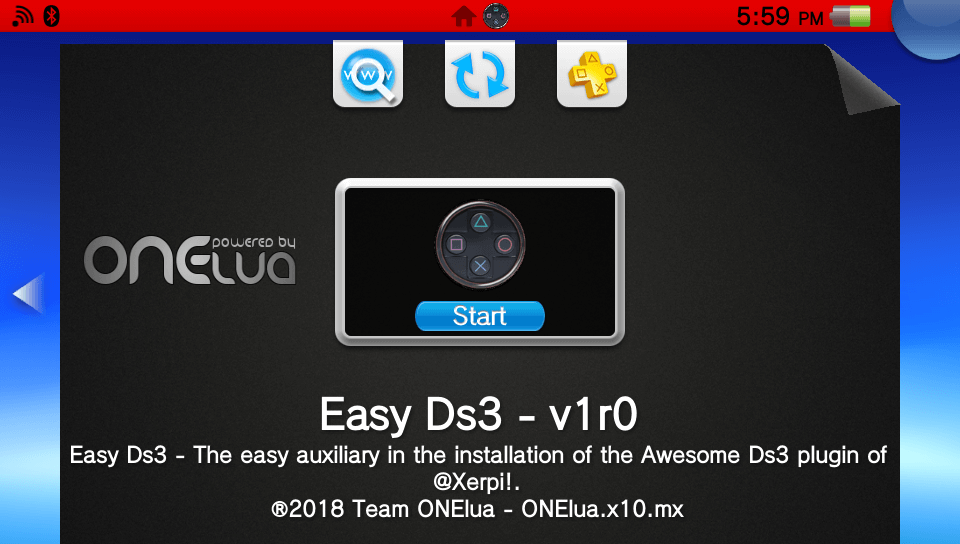
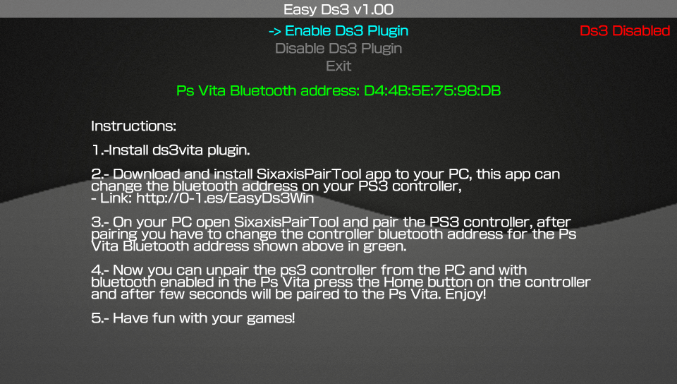

# Easy-Ds3     

Simple interface to support beginners to use Ds3vita.

### Description ###
This small application helps you to know the bluetooth address of your psvita, and it tells you some small steps to connect a ps3 control using the ds3vita of @Xerpi.

### Controls ###
- [up]/[down]: Browse the menu actions.
- [cross]: Perform the action selected in the menu.

### Changelog 1.0 ###
- Initial release.
- Added automatic network update. app will now notify you when there's a new update.
- Show bluetooth address and some small steps in screen.
- Install, enable/disable Ds3 Vita plugin of @Xerpi.

### Translations ###
If you want to help translate in your language, do not hesitate to contact me, please submit an issue or pull request.

### TO-DO ###
- Add more stuff (Suggestions are accepted).
The source code is too rudimentary and I hope to improve it :( , I wish to dedicate more time in the scene and do it soon.

### Credits ###
- BaltazaR4 for translation in english_us!.
- Raziel Meile for translation in spanish!.
- Xerpi for Awesome plugin ds3vita!.

### Report bugs ###
if you see something wrong, please submit an issue or pull request.

### Donation ###
In case you want to support my work on the vita, you can always donate for some coffee. Any amount is highly appreciated:

